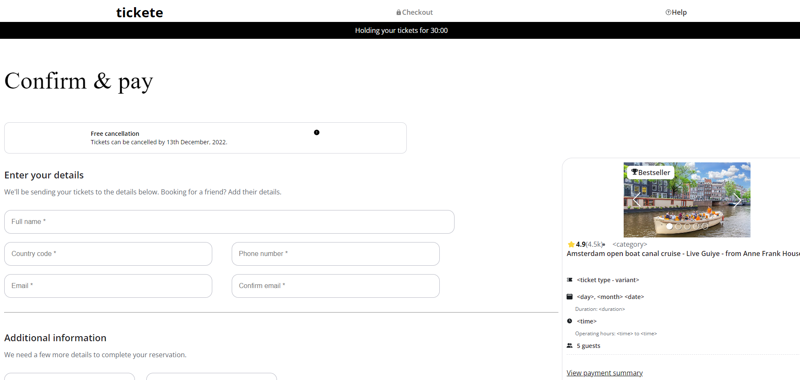

# [Tickete](https://tickete-assignment1.vercel.app/)

## 📌 Introduction

[](https://awesome.re)

• Built Responsive website using React, JavaScript, and core CSS

## 🚀 View Live Demo


<pre><center><a href="https://tickete-assignment1.vercel.app/"><b>tickete-assignment1.vercel.app/</b></a></center></pre>

## 👨‍💻 Tech Stack Used

-   React
-   module CSS
-   JavaScript

## 🛠️ Installation Steps

Star and Fork the Repo 🌟 and this will keep us motivated.

1. Clone the repository

```bash
git clone https://github.com/adityaK87/tickete-assignment.git
```

2. Change the working directory

```bash
cd tickete-assignment
```

3. Install dependencies

```bash
npm install
```

4. Run the app

```bash
npm run start
```

## 📸 Screenshots


